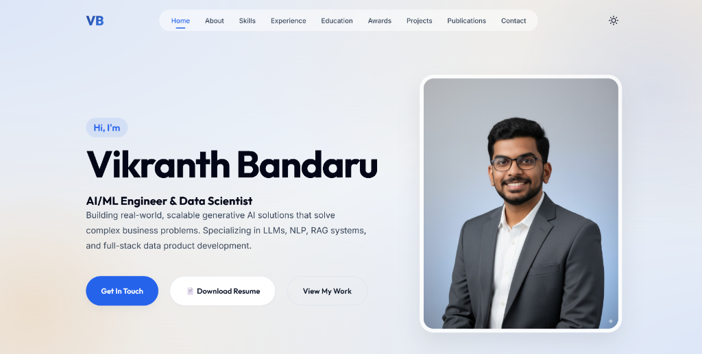

# Vikranth Bandaru - Portfolio

A modern, responsive personal portfolio website built to showcase my experience in AI/ML, Data Science, and Software Engineering.



##  Live Demo
[View Live Site](https://vikranthbandaru.github.io/)

##  Features
- **Modern Design**: Sophisticated Navy Blue & Gold color theme.
- **Responsive Layout**: Fully optimized for desktop, tablet, and mobile devices.
- **Interactive Elements**:
  - Smooth scroll navigation with active link highlighting (Scroll Spy).
  - Custom lightbox for viewing award certificates.
  - Mobile-friendly hamburger menu.
  - Scroll-triggered reveal animations.
- **Semantic HTML5**: Clean, accessible, and SEO-friendly structure.
- **Performance**: Lightweight, vanilla JavaScript implementation (no heavy frameworks).

##  Technologies Used
- **HTML5**: Semantic structure and content.
- **CSS3**: Custom properties (variables), Flexbox, Grid, and responsive media queries.
- **JavaScript (ES6+)**: DOM manipulation, IntersectionObserver for scroll animations and spy.
- **Font Awesome / SVG**: Icons for social links and UI elements.
- **Google Fonts**: 'Outfit' for headings and 'Inter' for body text.

##  Project Structure
```
/
├── assets/             # Images, logos, and resume
├── index.html          # Main HTML file
├── styles.css          # Main stylesheet
├── script.js           # JavaScript logic
└── README.md           # Project documentation
```

##  How to Run Locally
1.  **Clone the repository**:
    ```bash
    git clone https://github.com/vikranthbandaru/portfolio.git
    ```
2.  **Navigate to the project directory**:
    ```bash
    cd portfolio
    ```
3.  **Open `index.html`** in your web browser.


## Contact
**Vikranth Bandaru**
-  Email: [bandaruvikranth@gmail.com](mailto:bandaruvikranth@gmail.com)
-  LinkedIn: [vikranthbandaru](https://www.linkedin.com/in/vikranthbandaru/)
-  GitHub: [vikranthbandaru](https://github.com/vikranthbandaru)

---
© 2025 Vikranth Bandaru. All Rights Reserved.
